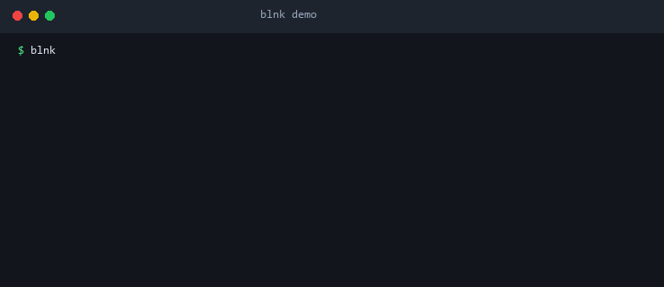

# blnk

P2P remote access ผ่าน WebRTC — ไม่ต้องสมัครบัญชี ไม่ต้อง forward port ใช้ RSA-2048 identity, 6-digit pairing code และ constant-time PIN auth



## ความสามารถหลัก

- **Shell & File Transfer** — remote shell และ file transfer ผ่าน SWSP over WebRTC Data Channel
- **mDNS Discovery** — ค้นหา peer ใน LAN อัตโนมัติ (`blnk devices --local`)
- **QR Pairing** — terminal QR code สำหรับ pair อุปกรณ์ทันที (`blnk serve --qr`)
- **NAT Traversal** — รองรับ STUN/TURN ICE servers ผ่าน `PeerHandle::with_ice_servers`
- **Local Fixture** — in-process test mode เต็มรูปแบบ (`--local-fixture`) ไม่ต้องใช้ secret ภายนอก
- **Loopback Browser Control** — `blnk web` สำหรับควบคุม lifecycle/status ผ่าน HTTP/WS บน loopback เท่านั้น
- **Proxy Streams** — TCP/WebSocket/HTTP ผ่าน `ProxyStreamService` ที่บังคับใช้ `ProxyPolicy` แบบ deny-by-default (dispatch เข้า session อยู่ใน Issue #42)
- **Encrypted Vault** — secret ที่ต้องการ confidentiality-at-rest เก็บใน `EncryptedVault` (XChaCha20-Poly1305)

## การติดตั้ง

**Windows (PowerShell):**
```powershell
irm https://raw.githubusercontent.com/bl1nk-bot/blnk/main/scripts/install.ps1 | iex
```

**Linux (Bash):**
```bash
curl -fsSL https://raw.githubusercontent.com/bl1nk-bot/blnk/main/scripts/install.sh | bash
```

ทั้งสองติดตั้งไปที่ `~/.blnk/bin` และเพิ่มเข้า PATH มี `--auto-update` flag สำหรับอัปเดตอัตโนมัติ

## เริ่มต้นใช้งาน

```bash
# Local fixture — ทดสอบ authenticated session แบบ in-process
cargo run -- serve --local-fixture --once
cargo run -- connect --local-fixture
cargo run -- cp --local-fixture ./local.txt remote.txt

# Device discovery (mDNS)
cargo run -- devices --list
cargo run -- devices --local

# Remote signaling/WebRTC
cargo run -- serve --signaling-url <URL> --pin <PIN>
cargo run -- connect --target <DEVICE_ID> --pin <PIN>

# Loopback browser control surface
cargo run -- web --host 127.0.0.1 --port 0 --origin http://127.0.0.1:3000

# QR pairing
cargo run -- serve --qr
```

## Platform Support

| Platform | หลักฐาน | สถานะ |
|---|---|---|
| Linux (`x86_64-unknown-linux-gnu`) | CI: format, check, test, clippy | `runner-tested` |
| Windows (`x86_64-pc-windows-msvc`) | CI build/test | `compile-verified` |
| Android (`aarch64-linux-android`) | CI compile-only | `compile-verified` |
| macOS | ไม่มี CI job | `not-tested` |

## สถาปัตยกรรม

```
Browser (loopback) ←HTTP/WS→ Web Control (Axum, loopback only)
     ↕
WebRTC Data Channel ← SWSP Frames → Remote Peer
     ↕
Stream Multiplexer (shell | file | proxy | tcp | websocket | http)
     ↕
Signaling Server ←→ WebSocket (mDNS เป็น fallback บน LAN)
```

ดูรายละเอียดเพิ่มเติมได้ที่:
- `CONTEXT.md` — domain glossary
- `docs/architecture.md` — module boundary & runtime model
- `docs/api.md` — API contract ภายใน
- `docs/blueprint.md` — target product voice card
- `docs/implementation-status.md` — สถานะ implementation และ release gate
- `STYLE.md` — coding conventions
- `PROTOCOL.md` — wire protocol

## Development

```bash
just ci               # fmt + clippy + check + test
cargo test <name>     # รัน test เดี่ยว
just build-release    # release build (lto, strip, abort)
```

ดูคำแนะนำสำหรับ agent ที่ `CLAUDE.md` และขั้นตอนการมีส่วนร่วมที่ `CONTRIBUTING.md`

## License

MIT