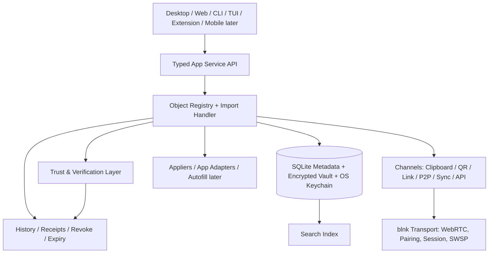

# Bl1nk: Implementation Blueprint, Product Design และ UI/UX

**ชื่อผลิตภัณฑ์ที่เสนอ:** Bl1nk Universal Transfer & Secure Workspace  
**บทบาทของผลิตภัณฑ์:** ชั้นกลางสำหรับเก็บ ค้นหา ส่งต่อ ใช้งาน และควบคุมความไว้วางใจของ objects ระหว่างคน เครื่อง แอป และบริการ  
**วันที่วิเคราะห์:** 14 กันยายน 2026  
**ผู้จัดทำ:** Manus AI  
**แหล่งข้อมูล:** `bl1nk-bot/blnk`, `farion1231/cc-switch` และข้อสรุปฉบับที่ 2 ที่แนบมา

> **วิธีอ่านเอกสารฉบับนี้:** Requirements ที่ผู้ใช้กำหนดคือเป้าหมายของผลิตภัณฑ์ โค้ดจาก `blnk` และ `cc-switch` คือฐานที่นำมา reuse หรือใช้เป็น implementation reference ส่วนความสามารถที่ยังไม่มีใน codebase ปัจจุบันถูกแปลงเป็น work package ที่ต้องสร้าง ไม่ได้ถูกตัดออกจากผลิตภัณฑ์

## 1. ข้อสรุปใหม่ในประโยคเดียว

**Bl1nk ไม่ควรเป็นเพียงแอปแชร์ MCP หรือแอปจัดการ provider แต่ควรเป็น Universal Transfer Layer ที่มี secure vault, transfer, router และ workspace control เป็นแกนเดียวกัน โดยเริ่มจาก AI configuration/MCP เป็น vertical slice แรก และต้องใช้งานได้ครบทั้งการสร้างหรือจับข้อมูล การค้นหา การส่ง การนำไปใช้ และการตรวจสอบความน่าเชื่อถือในเส้นทางเดียว**

แนวคิดนี้รวมข้อดีจากทั้งสองสรุปเข้าด้วยกัน:

- จากข้อสรุปฉบับที่ 2: ขอบเขตต้องกว้างกว่า MCP และต้องเป็น transfer layer ที่รองรับ object หลายชนิด
- จากเอกสาร Bl1nk Control Center: ต้องมีฐานข้อมูล, adapter, backup, atomic apply, profile, MCP และ desktop product shell
- จาก `blnk`: ใช้ P2P, device pairing, WebRTC, session และ existing CLI/web เป็น transport ที่มีอยู่จริง [1] [2]
- จาก `cc-switch`: ใช้ Tauri 2, React/TypeScript, SQLite, provider/profile UX, unified MCP, deep link, tray, backup, sync และ adapter-oriented product architecture เป็นแนวทางที่พิสูจน์คุณค่าระดับผลิตภัณฑ์แล้ว [3] [4]

## 2. ฐาน implementation และงานที่ต้องสร้าง

### 2.1 สิ่งที่ reuse ได้จาก codebase ปัจจุบัน

| ข้อเท็จจริง | แหล่งหลักฐาน | ผลต่อการออกแบบ |
|---|---|---|
| blnk มี Rust CLI และ subcommands `serve`, `connect`, `cp`, `devices`, `web` | README, CLI source และ implementation status | ย้าย/เชื่อมเข้า object-first CLI โดยคง compatibility |
| blnk มี WebRTC, signaling, pairing, SAS, PIN, SWSP และ stream handlers | `src/peer`, `src/signaling`, `src/protocol`, `src/session`, `src/stream` | ใช้เป็น transport/security foundation ได้ทันที |
| blnk มี loopback Axum web control ที่ตรวจ origin, cookie, CSRF และ WebSocket lifecycle | `src/web/mod.rs` | ใช้เป็น local API หรือ web surface ได้ แต่ยังไม่ใช่ product UI ที่สมบูรณ์ |
| blnk ใช้ RSA-2048 เป็น identity protocol เดิม | `CONTEXT.md`, `PROTOCOL.md`, identity implementation | คง RSA compatibility และเพิ่มงาน `Signer` abstraction, Ed25519 default ใหม่ และ ML-DSA hybrid migration ตาม security work package |
| macOS ของ blnk ยังไม่มี CI evidence | README และ implementation status | เพิ่มเป็น work package: packaging, signing และ runner tests |
| cc-switch ใช้ Tauri 2 + React/TypeScript + Rust | README และ `src-tauri/Cargo.toml` | ใช้เป็น desktop product shell ได้ |
| cc-switch มี SQLite, migrations, backup/restore และ atomic import | `src-tauri/src/database` | ใช้เป็น persistence pattern ได้ทันที |
| cc-switch มี provider profiles, MCP, prompts, skills, deep links, tray, sync, usage และ session surface | README และ source tree | ใช้เป็น product feature baseline ได้ |
| cc-switch มี adapter-specific code ต่อหลาย AI client | `src-tauri/src/mcp`, config modules และ command modules | reuse patterns และสร้าง adapter registry ของ Bl1nk |

### 2.2 สิ่งที่ต้อง implement เพิ่มตาม requirements

รายการต่อไปนี้เป็น **งานที่ต้องสร้าง** เพื่อให้ product requirements เกิดขึ้นจริง: Universal Object Model, Object Manifest, Base/View schema, object registry, vault/index/search, Tauri product shell, SQLite domain schema, adapter registry, profile/MCP/workspace lifecycle, send/receive pipeline, share envelope, extension autofill, mobile receive surface, usage/health, sync, workflow runtime, OAuth, passkey และ post-quantum migration path โค้ดปัจจุบันไม่ได้ลบ requirement เหล่านี้ออก แต่ช่วยลดงานในส่วน transport, pairing, session, WebRTC, CLI และ adapter patterns

## 3. คำตอบต่อประเด็นที่ขัดแย้ง

### 3.1 Zero-config หรือ “ตั้งค่าเท่าที่จำเป็น”

**คำตอบ:** ใช้คำว่า **zero-account, low-configuration** แทน zero-config

blnk เดิมมีจุดขาย “no accounts, no port forwarding” แต่แอปที่ทำหน้าที่ vault, adapter, keychain, file permissions และ live configuration จำเป็นต้องมีการตั้งค่าครั้งแรก การสื่อว่าไม่ต้องตั้งค่าเลยจะไม่ตรงกับพฤติกรรมจริงและทำลายความเชื่อมั่นเมื่อผู้ใช้พบ onboarding

ข้อกำหนดใหม่จึงเป็น:

- ไม่ต้องสร้าง cloud account สำหรับ local/P2P core
- ไม่ต้อง port forwarding สำหรับ transport ที่รองรับ NAT traversal
- ตั้งค่าเริ่มต้นให้น้อยที่สุด
- ตรวจพบแอปและ config อัตโนมัติแบบ read-only
- ซ่อน advanced settings จนกว่าผู้ใช้จะเปิดเอง
- มี onboarding ที่ทำเสร็จได้ภายในหนึ่งขั้นตอนหลัก

**คำที่ควรใช้:** “ไม่ต้องสมัครบัญชี, ตั้งค่าน้อย, ส่งได้ทันทีหลังติดตั้ง”

### 3.2 แอปแชร์ MCP หรือ Universal Transfer Layer

**คำตอบ:** positioning เป็น **Universal Transfer Layer** แต่ MCP/AI configuration เป็น vertical slice แรก

หากวางตัวเป็น MCP อย่างเดียว ตลาดและ object scope จะแคบเกินไป หากเริ่มด้วย “ส่งอะไรก็ได้” โดยไม่มี object model, search และ consumer ที่ชัดเจน ผลิตภัณฑ์จะกลายเป็น file transfer ที่ไม่มีเหตุผลให้ใช้ซ้ำ

ลำดับที่สมเหตุสมผลคือ:

```text
Universal Object Model
        ↓
AI configuration / MCP / workspace pack เป็น first complete path
        ↓
Note / secret / Wi-Fi / bookmark / file / QR / webhook
        ↓
Capability, OAuth grant และ app automation ภายหลัง
```

### 3.3 5 surfaces หรือ 8 surfaces

**คำตอบ:** แบ่งเป็น 5 core surfaces และ 3 expansion surfaces

| กลุ่ม | Surface | สถานะ |
|---|---|---|
| Core | Desktop/Web workspace | รุ่นแรก |
| Core | CLI | มีอยู่แล้วและต้องรักษา |
| Core | TUI | รุ่นแรกแบบ companion/low-resource |
| Core | Share/Receive web landing | รุ่นแรกเพื่อรับจาก link/QR |
| Core | P2P device surface | รุ่นแรกผ่าน blnk transport |
| Expansion | Browser extension/autofill | หลัง core object flow เสถียร |
| Expansion | Mobile share sheet/app | หลัง web mobile flow ผ่านการทดลอง |
| Expansion | SDK/API/OAuth/webhook | หลัง object contract และ permission model เสถียร |

ดังนั้น “8 surfaces” ถูกต้องในเชิง product map แต่ไม่ควรบังคับให้ทั้ง 8 ต้องเสร็จใน release แรก

### 3.4 TUI หรือ Tauri desktop

**คำตอบ:** ไม่เลือกอย่างใดอย่างหนึ่ง ให้ใช้ **Tauri เป็น rich desktop shell, CLI/TUI เป็น first-class companion, Web เป็น universal fallback**

การใช้ TUI เป็น UI หลักไม่เหมาะกับ editor, diff, search, dashboard, QR preview, keychain prompt และ responsive layout จำนวนมาก การใช้ Tauri อย่างเดียวก็ทำให้สูญเสียความสามารถ headless และความแข็งแรงของ CLI เดิม

สถาปัตยกรรมที่เหมาะสม:

```text
Tauri Desktop UI ─┐
Responsive Web UI ─┼─> Typed App Service API ─> Domain + Storage + Transport
CLI ──────────────┤
TUI ──────────────┘
```

TUI ไม่ควรเป็นการเขียน logic ซ้ำ แต่เป็น client ของ application service เดียวกับ desktop และ CLI

### 3.5 Base + GitHub Workflow เป็น schema หลักหรือไม่

**คำตอบ:** นำแนวคิด `Base` มาใช้เป็น view/index schema ได้ แต่ยังไม่ปิดคำถามว่า Base เท่ากับ GitHub Workflow หรือไม่

แนวคิดที่มีประโยชน์คือแยก:

- **Object:** เนื้อหาหรือข้อมูลที่ส่งต่อ
- **Index/Base:** มุมมอง, filter, formula, grouping และ summary เหนือ objects
- **Profile:** identity, permission และ active context
- **Settings:** ค่า runtime ของแอป
- **Workflow:** เครื่องจักรที่ประมวลผล event และ action

แต่ GitHub Actions workflow เป็น execution schema ที่มี side effect ส่วน Base เป็น view/schema layer ทั้งสองมีโครงสร้างคล้ายกันบางส่วน แผนงานจึงต้องสร้าง formal grammar, evaluator, permission model และ test suite ก่อนเชื่อมสอง namespace ให้ทำงานร่วมกัน โดยไม่ตัดแนวคิดนี้ออกจาก product requirements

ข้อเสนอคือสร้าง **Bl1nk Object Manifest** แบบ versioned และให้ Base/View กับ Workflow/Action เป็นคนละ namespace:

```yaml
version: 1
kind: mcp.server
metadata:
  name: filesystem
content:
  transport: stdio
  command: npx
  args: ["-y", "server-filesystem"]
view:
  title: Filesystem MCP
policy:
  allow: [read]
actions: []
```

Config/manifest ไม่ควร hash, randomize, encrypt, ยิง HTTP หรือทำ side effect เอง งานดังกล่าวต้องอยู่ใน machine/runtime layer

### 3.6 “ครบ 100% หรือแพ้”

**คำตอบ:** ใช้หลักนี้กับ **vertical slice ที่เปิดตัว** ไม่ใช้กับทั้งผลิตภัณฑ์ตั้งแต่วันแรก

ผลิตภัณฑ์ที่เริ่มจาก object ทุกชนิด, extension, mobile, OAuth, proxy และ workflow พร้อมกันมีความเสี่ยงสูงที่จะไม่มีสิ่งใดเสร็จจริง กติกาที่ใช้ได้คือ:

> ทุก release ต้องทำอย่างน้อยหนึ่งเส้นทางตั้งแต่ Capture → Retrieve → Deliver → Consume → Trust → History ให้ครบและน่าเชื่อถือ

MVP ที่เหมาะสมคือ `MCP/Workspace Pack` เพราะมี use case, adapter และความต้องการจากทั้ง blnk กับ cc-switch อยู่แล้ว จากนั้นเพิ่ม object kind อื่นผ่าน trait/adapter โดยไม่แตะ lifecycle core

### 3.7 Crypto ที่ “ตัดสินใจแล้ว” กับ crypto ที่มีหลักฐาน

**คำตอบ:** แยก compatibility crypto, product envelope crypto และ future crypto

| ชั้น | การตัดสินใจ |
|---|---|
| Existing blnk identity | คง RSA-2048 เพื่อ protocol compatibility จนกว่าจะมี migration/interop plan |
| New share envelope signing | สร้าง `Signer` abstraction; เริ่มจาก algorithm ที่มี implementation/test จริงใน codebase หรือ dependency ที่ผ่าน review |
| Symmetric encryption | ใช้ authenticated encryption ที่มี maintained Rust implementation และ threat review; อย่าอ้าง XChaCha20-Poly1305 ว่าใช้แล้วโดยไม่มี code/evidence |
| Hash/KDF | SHA-256 และ Argon2id ใช้ใน boundary ที่มีหลักฐาน; BLAKE3 เป็นตัวเลือก ไม่ใช่ requirement จน benchmark/interop ระบุ |
| Post-quantum | ML-DSA-65 เป็น research/roadmap option ไม่ใช่ MVP dependency |
| Passkey | FIDO2/WebAuthn เป็น auth provider ภายหลัง ไม่ใช่ transport primitive |

แนวทางนี้ไม่อนุรักษ์นิยม แต่ป้องกันไม่ให้ product claim เกินสิ่งที่ implementation และ test รองรับ

### 3.8 PIN 6 หลักหรือ XXXX-XXXX 8 หลัก

**คำตอบ:** แยก **legacy pairing PIN** กับ **share access code**

- PIN 6 หลักคงไว้เพื่อ compatibility กับ session/pairing เดิมของ blnk
- Share access code ใช้ 8 ตัวในรูป `XXXX-XXXX` ได้ หากผู้ใช้ต้องพิมพ์ผ่าน UI/เว็บ
- UI ไม่ควรเรียกทั้งสองค่าเหมือนกัน ควรใช้ “รหัสจับคู่เครื่อง” กับ “รหัสเปิดกล่องแชร์”
- ทั้งสองค่าต้องมี TTL, attempt limit, lockout และ one-time policy ตาม use case

## 4. Product model ใหม่

### 4.1 Object kinds

Bl1nk ใช้ object registry เพื่อรองรับสิ่งที่ส่งต่อได้ โดยไม่อ้างว่า object ทุกชนิดพร้อมใช้งานใน release เดียว

| กลุ่ม | Object kind รุ่นแรก/ภายหลัง | Consumer |
|---|---|---|
| Content | note, markdown, prompt | editor, file, workspace |
| Configuration | mcp, provider, profile, workspace-pack | AI clients, adapters |
| Secret | password, login, Wi-Fi, TOTP | keychain, clipboard, autofill ภายหลัง |
| Reference | bookmark, link, file reference, QR | browser, file manager |
| Capability | webhook, button, OAuth grant | runtime/connector ภายหลัง |
| Route | P2P device, gateway, subscription | transport/sync ภายหลัง |
| Container | vault, collection, clipboard item | vault/search/share UI |

ทุก object ต้องมี `id`, `kind`, `schema_version`, `title`, `content`, `sensitivity`, `provenance`, `created_at`, `updated_at`, `revision` และ `permissions` อย่างน้อย

### 4.2 Lifecycle กลาง

```text
Capture
  ↓
Normalize
  ↓
Store encrypted/metadata-separated
  ↓
Index and search
  ↓
Preview and policy check
  ↓
Deliver through channel
  ↓
Consume/apply/fill
  ↓
Receipt, history, revoke/expire
```

Channels ได้แก่ local import/export, clipboard, QR, deep link, HTTPS landing, P2P, WebDAV/S3, extension และ API แต่ทุก channel ต้องคืนผลเป็น object import job เดียวกัน

### 4.3 Traits

```rust
trait ObjectHandler {
    fn kind(&self) -> ObjectKind;
    fn validate(&self, object: &Object) -> Result<ValidatedObject>;
    fn redact(&self, object: &Object) -> RedactedObject;
    fn preview(&self, object: &Object) -> PreviewModel;
    fn apply(&self, object: &Object, target: Target) -> Result<ApplyReceipt>;
}

trait Channel {
    fn offer(&self, object: ShareEnvelope) -> Result<OfferHandle>;
    fn receive(&self, input: ChannelInput) -> Result<ImportJob>;
}

trait Verifier {
    fn verify(&self, envelope: &ShareEnvelope, proof: Proof) -> Result<VerifiedShare>;
}
```

`import_handler()` ยังคงเป็น orchestration layer กลาง แต่ไม่ควรผูกกับ MCP เท่านั้น

## 5. สถาปัตยกรรมที่สรุปใหม่



### 5.1 Runtime choices

| Component | ข้อสรุป |
|---|---|
| Desktop | Tauri 2 + React/TypeScript; เหมาะกับ rich UI และ packaging |
| Backend | Rust application services; reuse/adapt blnk core |
| CLI | รักษา `blnk` เดิมและเพิ่ม object/share commands |
| TUI | client แบบ low-resource สำหรับ server/terminal users |
| Web | responsive local web และ public landing/import page แบบจำกัดข้อมูล |
| Database | SQLite metadata, migrations, atomic transactions |
| Secret storage | OS keychain หรือ encrypted vault แยกจาก metadata |
| Transport | blnk P2P เป็น default device channel; cloud connectors optional |
| Extension | เพิ่มเมื่อ autofill contract และ permission model พร้อม |

## 6. UI/UX design system

### 6.1 หลักการ UX

1. ผู้ใช้เริ่มจากสิ่งที่ต้องการทำ ไม่เริ่มจาก protocol หรือ trust tier
2. ผู้ใช้เห็นว่า object คืออะไร ใครส่งให้ อยู่ได้นานเท่าไร และจะไปมีผลที่ใด
3. ความลับถูกซ่อนโดย default แต่เปิดดูได้หลังยืนยันตัวตน
4. การส่งและการรับใช้ภาษาคน: “ส่งให้ใคร”, “ให้เปิดได้ถึงเมื่อไร”, “เปิดแล้วใช้ที่ไหน”
5. ทุกการเปลี่ยน live configuration ต้องมี preview, backup และ undo
6. advanced settings ซ่อนหลัง progressive disclosure
7. error ต้องบอกสาเหตุ ผลกระทบ และทางแก้ ไม่แสดง cryptographic internals เป็นข้อความหลัก

### 6.2 Design tokens

| Token group | ค่าเริ่มต้น |
|---|---|
| Spacing | 4, 8, 12, 16, 24, 32, 48, 64 px |
| Radius | 4, 8, 12, 16, full |
| Typography | Inter + IBM Plex Sans Thai; JetBrains Mono สำหรับ code/ID |
| Body | 14–16 px; small 12 px; heading 20–32 px |
| Semantic colors | background, surface, border, text, muted, accent, success, warning, danger, sensitive |
| Motion | 120 ms micro, 200 ms state, 320 ms panel |
| Breakpoints | 640, 768, 1024, 1280 px |
| Sensitive treatment | masked text, no redaction color alone, explicit “sensitive” label |

### 6.3 Desktop information architecture

```text
Bl1nk
├── Home
├── Inbox
├── Vault
│   ├── All objects
│   ├── Notes
│   ├── Configurations
│   ├── Secrets
│   ├── Links & QR
│   └── Packs
├── Send
├── Receive
├── Devices
├── Workspaces
├── Activity
├── Backups & Sync
└── Settings
```

**Home** แสดง active workspace, recent objects, pending receives, trusted devices, expiring shares และ quick actions

**Vault** เป็นพื้นที่ค้นหาและกรอง objects ไม่ใช่หน้าตั้งค่าเทคนิค ผู้ใช้ควรเห็น title, kind, sensitivity, source, last used และ available actions

**Send** เป็น wizard ที่เลือก object ก่อนเลือก channel

**Receive** รวม deep link, QR scan, PIN, clipboard paste และ pending P2P sessions

**Devices** แสดงชื่อเครื่อง, trust state, last seen, capabilities และ revoke

**Workspaces** รวม profile, MCP, prompts, skills และ app bindings สำหรับกลุ่มผู้ใช้ AI

### 6.4 Desktop three-zone layout

```text
┌─────────────────────────────────────────────────────────────────────┐
│ Bl1nk  [Search / Command Palette]          Workspace  Device  [?]   │
├───────────────┬─────────────────────────────┬───────────────────────┤
│ LIST / FILTER │ DETAIL / PREVIEW            │ ACTION / CONTEXT      │
│               │                             │                       │
│ All objects   │ filesystem-mcp              │ [Send] [Use] [Edit]   │
│ Config        │ kind: MCP                   │                       │
│ Secrets       │ source: Local                │ Target apps           │
│ Packs         │ sensitivity: Sensitive      │ Claude   ✓            │
│ Expiring      │ last used: today             │ Codex    ✓            │
│               │ fields masked               │ OpenCode ○            │
│               │ [Show after unlock]          │                       │
├───────────────┴─────────────────────────────┴───────────────────────┤
│ Status: saved locally  |  2 devices  |  1 share expires in 4 min    │
└─────────────────────────────────────────────────────────────────────┘
```

### 6.5 Home screen

Home ต้องไม่กลายเป็น dashboard ที่เต็มไปด้วย metrics ผู้ใช้ต้องเห็นสิ่งที่ทำต่อได้ทันที:

```text
[ส่งของ] [รับของ] [เพิ่มจาก clipboard] [สร้างจาก template]

กำลังจะหมดอายุ
- MCP pack จาก Work laptop       04:32  [เปิด] [ต่ออายุ]

ใช้งานล่าสุด
- Claude profile: research        [ใช้] [ส่ง]
- Wi-Fi office                    [คัดลอก] [ส่ง]

อุปกรณ์ที่ไว้ใจ
- ThinkPad T14                    online
- Mac mini                        last seen 2h ago
```

### 6.6 Send flow

```text
เลือก object/pack
   ↓
เลือกผู้รับหรือช่องทาง
   ↓
เลือกสิทธิ์: ดูครั้งเดียว / ใช้ได้ถึงเวลา / แก้ไขได้หรือไม่
   ↓
ตรวจรายการที่จะส่งและข้อมูลที่ถูกตัดออก
   ↓
สร้าง QR / link / PIN / P2P offer
   ↓
แสดงสถานะ opened / consumed / expired
```

คำถาม “จะส่งผ่าน channel ใด” ควรอยู่หลังคำถาม “จะส่งอะไรและให้ใคร” ผู้ใช้สามารถเลือก Auto ซึ่งพยายาม P2P ก่อน แล้ว fallback เป็น QR/link ตามความพร้อม

### 6.7 Receive flow

```text
รับจาก link / QR / clipboard / device
   ↓
ตรวจ source, sender, expiry และ signature
   ↓
แสดง preview แบบ redacted
   ↓
ขอ PIN/passkey ถ้าจำเป็น
   ↓
เลือก destination หรือ app
   ↓
แสดง diff และผลกระทบ
   ↓
Commit + receipt + undo
```

### 6.8 Object detail screen

ทุก object ใช้ detail template เดียวกัน:

- Header: ชื่อ, kind, sensitivity, provenance
- Preview: ค่าที่ redacted และ schema fields
- Use: ปุ่ม `ใช้`, `เปิดในแอป`, `เติมข้อมูล`, `ติดตั้ง`, หรือ `คัดลอก`
- Share: เลือก recipient, expiry, one-time, channel
- History: created, viewed, used, modified, revoked
- Security: verified by, device, signature, last access

### 6.9 Workspace/Packs สำหรับ AI

Workspace view เป็นส่วนที่เชื่อมข้อสรุปทั้งสองด้านเข้าด้วยกัน:

```text
Research Workspace
├── Active provider: Anthropic relay
├── Apps: Claude Code ✓, Codex ✓, OpenCode ○
├── MCP: filesystem ✓, browser ✓
├── Prompts: research.md, AGENTS.md
├── Skills: citation-checker, web-research
├── Share pack [รวมทั้งหมด] [เลือกบางส่วน]
└── Preview activation [แสดง diff]
```

## 7. UI/UX ของแต่ละ surface

### 7.1 CLI

คำสั่งต้องเป็น object-first และยังรองรับคำสั่งเดิม:

```text
blnk list
blnk get <id>
blnk capture --kind mcp --file config.json
blnk send <id> --to device:work-laptop
blnk receive <link-or-file> --preview
blnk use <id> --target claude,codex
blnk history
blnk devices
blnk serve --qr
```

คำสั่งเดิม `serve`, `connect`, `cp`, `devices`, `web` ต้องไม่ถูกลบ แต่ควรมี compatibility help และแยกหมวด `transport` กับ `objects`

### 7.2 TUI

TUI ใช้สำหรับ terminal-first users และ headless machines ไม่พยายามเลียนแบบ desktop ทุกอย่าง

```text
┌─ blnk ─ v0.4 ─ workspace: research ─ locked ───────────────────────┐
│ [1] Home [2] Send [3] Receive [4] Vault [5] History [6] Devices    │
├──────────────────────┬─────────────────────────────────────────────┤
│ / ค้นหา              │ filesystem-mcp                              │
│ ▸ All                │ kind: mcp   sensitivity: sensitive          │
│   Config             │ status: verified                            │
│   Secret             │ targets: Claude, Codex                      │
│   Pack               │ [Enter] preview  [s] send  [u] use  [g] QR  │
├──────────────────────┴─────────────────────────────────────────────┤
│ [/] search [c] copy masked [s] share [p] command palette [q] quit  │
└─────────────────────────────────────────────────────────────────────┘
```

TUI ต้องใช้ `TerminalGuard`, panic restore, masked sensitive values และ TestBackend ตาม requirement เดิมของ blnk

### 7.3 Responsive Web

Web มีสองบทบาทที่ต่างกัน:

1. **Local control surface:** จัดการแอปที่ติดตั้งในเครื่องผ่าน loopback และใช้ security boundary ของ blnk เดิม
2. **Share landing/receive surface:** แสดงข้อมูลขั้นต่ำ รับ link/QR/PIN และส่งต่อเข้า desktop หรือ web flow

Web landing ห้ามเป็น vault เต็มรูปแบบตั้งแต่แรก และห้ามแสดง plaintext secret บน server-side page

### 7.4 Browser extension

Extension เป็น expansion surface ไม่ใช่ MVP แต่ contract ต้องเตรียมไว้:

- content script ตรวจ field แบบ local-only
- background service worker คุยกับ local app ผ่าน native messaging หรือ localhost bridge
- ไม่ส่ง field content ไป cloud
- ไม่ autofill เองโดยไม่มี user gesture
- แสดง badge เมื่อพบ candidate
- map field กับ object kind และ slot
- เก็บเพียง reference ไม่เก็บ secret plaintext ใน extension storage หากไม่จำเป็น

### 7.5 Mobile

ยังไม่ตัดสินว่า native app หรือ web app ข้อสรุปที่เหมาะสมคือทำ **mobile-friendly web receive/share flow** ก่อน แล้วเก็บข้อมูลเพื่อเลือก native หรือ share sheet ภายหลัง

## 8. Security และ trust UX

### 8.1 ภาษาที่ผู้ใช้เห็น

ไม่แสดง T0/T1/T2/T3 เป็น primary label ให้ใช้:

- “เฉพาะเครื่องนี้”
- “ผู้รับที่เลือก”
- “ใครมีลิงก์ก็เปิดได้”
- “ต้องยืนยันตัวตนเพิ่ม”
- “เปิดได้ครั้งเดียว”
- “หมดอายุใน …”

Trust tier เป็น internal policy และแสดงเป็นรายละเอียดรอง

### 8.2 Share card

```text
ส่ง: Research Workspace Pack
ผู้รับ: Work laptop
สิ่งที่จะส่ง: MCP 3 รายการ, prompt 2 รายการ, skill metadata 4 รายการ
ไม่รวม: API keys, passwords, local paths
ยืนยันตัวตน: pairing + share code
หมดอายุ: 10 นาที
การใช้งาน: ครั้งเดียว
[ยกเลิก] [สร้างการส่ง]
```

### 8.3 Autofill และ clipboard

Clipboard auto-clear 30 วินาทีเป็น default ที่สมเหตุสมผลสำหรับ secret ที่ผู้ใช้คัดลอก แต่การทำให้ clipboard invisible ทุก OS ไม่ควรเคลมจนกว่าจะทดสอบ platform จริง การ autofill ต้องเกิดหลัง user gesture และควรเริ่มจาก password/TOTP ที่มี schema ชัด ก่อนขยายไป arbitrary fields

## 9. Roadmap ฉบับรวมใหม่

### Phase 0 — Product contract และ primitive

สร้าง object manifest, object registry, sensitivity/provenance model, import job, receipt, typed service API, SQLite schema, migrations, keychain boundary และ design system

**ต้องเสร็จ:** object CRUD, search metadata, redaction, backup, audit event และ client contract ของ CLI/TUI/Desktop

### Phase 1 — First complete vertical slice: MCP/Workspace Pack

ทำ Capture → Retrieve → Deliver → Consume → Trust → History ให้ครบสำหรับ MCP, provider profile, prompt, skill metadata และ workspace pack

**Channel:** local import/export, clipboard, QR และ P2P blnk  
**Surface:** Tauri desktop, CLI และ responsive receive web  
**ต้องเสร็จ:** preview, apply, backup, rollback, expiry, one-time, receipt

### Phase 2 — Desktop Control Center

ส่งมอบ Tauri desktop shell, Home, Vault, Send, Receive, Devices, Workspaces, Activity, Backups/Sync และ Settings รวมถึง tray, onboarding, dark/light theme และ i18n

### Phase 3 — Full AI adapters และ bidirectional sync

เพิ่ม Claude Code, Claude Desktop, Codex, Gemini CLI, OpenCode และ client อื่นตาม capability matrix รวม provider presets, MCP sync, prompt/skill mapping, conflict UI และ import live config

### Phase 4 — Universal object expansion

เพิ่ม note, bookmark, file reference, Wi-Fi, password, TOTP, QR และ generic pair object โดยใช้ ObjectHandler เดิม ไม่สร้าง lifecycle ใหม่แยกตาม kind

### Phase 5 — Share channels และ public web

เพิ่ม deep link, signed HTTPS link, QR PNG/SVG/ANSI, browser “Add to Bl1nk”, optional short-link resolver, link revoke และ landing page โดยไม่เก็บ plaintext secret

### Phase 6 — TUI/CLI parity และ extension prototype

ทำ TUI แบบ companion ให้ครบ action สำคัญ, เพิ่ม command palette, clipboard countdown, native messaging bridge และ extension autofill prototype ที่มี permission จำกัด

### Phase 7 — Sync, usage และ health

เพิ่ม P2P sync, local folder, WebDAV/S3 optional, conflict resolver, provider health, usage dashboard, session manager และ retention settings

### Phase 8 — Advanced capabilities

เพิ่ม proxy/failover, webhook/button, OAuth grant, passkey, delegated app access, SDK และ API ตาม use case ที่พิสูจน์แล้ว

### Phase 9 — Mobile form factor decision

ตัดสินจากข้อมูลการใช้งานจริงว่าจะทำ responsive web ต่อ, PWA, native app หรือ share sheet โดยไม่เริ่มจากสมมติฐาน

## 10. Implementation work packages และ dependency graph

| ID | Work package | ต้องสร้าง/แก้ไข | Dependency | ผลลัพธ์ส่งมอบ |
|---|---|---|---|---|
| WP-01 | Product contracts | object kinds, manifest version, sensitivity, provenance, receipt และ error codes | ไม่มี | domain contract ที่ทุก client ใช้ร่วมกัน |
| WP-02 | Storage foundation | SQLite schema, migrations, encrypted vault, keychain adapter, FTS search, backup | WP-01 | persistent store และ restore point |
| WP-03 | Application service API | typed commands/events สำหรับ desktop, CLI, TUI, web | WP-01, WP-02 | service boundary เดียว ไม่มี logic ซ้ำตาม UI |
| WP-04 | Object registry | handler registry, validation, redaction, preview, apply, history | WP-01, WP-03 | object lifecycle กลาง |
| WP-05 | AI adapters | Claude, Codex, Gemini, OpenCode, MCP, prompts, skills, workspace projection | WP-04 | import/preview/activate/rollback ต่อ client |
| WP-06 | Desktop shell | Tauri, React, routing, design system, onboarding, tray, i18n | WP-03, WP-04 | rich desktop UI |
| WP-07 | Send/receive pipeline | capture, normalize, package, preview, commit, receipt | WP-04, WP-05 | first complete vertical slice |
| WP-08 | blnk transport adapter | map offer/receive ไปยัง WebRTC, pairing, session, SWSP และ progress | WP-07 + existing blnk core | P2P transfer ที่ใช้กับ object ทุก kind |
| WP-09 | Share security | envelope encryption/signing, TTL, one-time, revoke, audience, PIN/access code | WP-01, WP-07, WP-08 | trusted share lifecycle |
| WP-10 | Channels | QR, clipboard, deep link, HTTPS landing, local file, fallback resolver | WP-07, WP-09 | ทุก channel เข้า pipeline เดียว |
| WP-11 | Sync | P2P sync, local folder, WebDAV/S3 connector, revision/conflict merge | WP-02, WP-04, WP-08 | cross-device state sync |
| WP-12 | Workflow/Base runtime | Base/View schema, formula evaluator, action namespace, permission sandbox | WP-01, WP-02, WP-04 | programmable views/actions โดยไม่ให้ config มี side effect เอง |
| WP-13 | Extension/autofill | content script, background, local bridge, field matching, user gesture | WP-03, WP-04, WP-09 | autofill ที่ไม่ส่งข้อมูลออก cloud |
| WP-14 | Usage/health/proxy | local usage events, provider health, routing, failover, circuit breaker | WP-05, WP-11 | power-user operational layer |
| WP-15 | Delegated access | OAuth/PKCE, passkey, scopes, audit export, device enrollment | WP-09, WP-11 | app/team access layer |
| WP-16 | Release engineering | Windows/macOS/Linux installers, signing, update, CI, evidence matrix | WP-06, WP-08, WP-10 | release artifacts และ support evidence |

ลำดับการทำจริงคือ `WP-01 → WP-02 → WP-03 → WP-04 → WP-05/WP-06 → WP-07 → WP-08/WP-09 → WP-10 → WP-11/WP-12 → WP-13/WP-14/WP-15 → WP-16` โดยงานที่เขียนว่า existing blnk core หมายถึงนำมา reuse แล้วทำ adapter/integration ไม่ใช่หยุดอยู่ที่โค้ดเดิม

### 10.1 ทีมและ ownership ที่ต้องมี

งานนี้ควรแบ่งเป็น tracks ที่ทำคู่ขนานได้: **Product/UX**, **Domain/Storage**, **Adapters**, **Transport/Security**, **Desktop/Web**, **Extension/Mobile**, และ **Release/QA** แต่ละ track ต้องมี contract ต่อกันผ่าน schema และ typed API ไม่ควรสื่อสารด้วยการแก้ JSON หรือ UI behavior แบบเฉพาะกิจ

### 10.2 First release scope ที่ต้องส่งมอบจริง

Release แรกต้องไม่ใช่เพียง shell หรือ demo QR แต่ต้องเป็นเส้นทางที่จบได้: detect/import MCP หรือ Workspace Pack → ค้นหา → preview → ส่งผ่าน QR/clipboard/P2P → verify → apply เข้า target app → backup/rollback → แสดง receipt/history ส่วน object ชนิดอื่นสามารถตามมาได้ แต่ต้องเข้ากับ WP-01 และ WP-04 ตั้งแต่แรก

## 11. Definition of Done ใหม่

แต่ละ vertical slice ต้องมีองค์ประกอบครบดังนี้:

1. Capture หรือ import ที่ทำได้จริง
2. Retrieve ที่ค้นหาเจอเร็วและมี history
3. Deliver ผ่าน channel ที่ระบุ
4. Consume หรือ apply ไปยัง target จริง
5. Trust preview, expiry, recipient และ security state
6. Backup, rollback หรือ undo
7. Error state และ recovery path
8. Unit/integration/E2E tests
9. Support matrix ตาม platform จริง
10. Documentation และ redaction audit

คำว่า “ครบ 100%” จึงหมายถึง **ครบทั้งเส้นทางของ feature ที่ประกาศใน release** ไม่ใช่ประกาศว่าระบบรองรับ object, platform และ channel ทุกชนิดตั้งแต่วันแรก

## 12. คำถามที่ยังไม่ได้ตอบ

รายการต่อไปนี้ยังต้องมีการทดลองหรือการตัดสินใจเชิงผลิตภัณฑ์ ไม่ควรเขียนเป็นข้อสรุปที่ปิดแล้ว:

1. **ชื่อผลิตภัณฑ์สุดท้าย** จะใช้ `blnk`, `Bl1nk`, `Bl1nk Control Center` หรือชื่อที่สื่อ Universal Transfer ชัดกว่านี้
2. **MVP target** จะเน้น AI Workspace Pack เป็น first slice หรือเริ่มจาก generic object เช่น note/secret/file ก่อน
3. **แหล่งเก็บ secret** จะใช้ Windows Credential Manager, macOS Keychain, Linux Secret Service, encrypted vault หรือรองรับหลาย backend พร้อมกัน
4. **Object Manifest** จะใช้ canonical JSON, YAML, CBOR หรือ schema ที่แยก display manifest กับ encrypted payload
5. **Base/View schema** จะเป็นเพียง view layer หรือจะมี formula evaluator เต็มรูปแบบในรุ่นแรก
6. **ความสัมพันธ์กับ GitHub Workflow** จะเป็น integration adapter, inspiration หรือจะมี workflow runtime ของ Bl1nk เอง
7. **Desktop shell** จะสร้าง Tauri app ใหม่หรือ integrate เข้า web/CLI ของ blnk เดิมบางส่วนเพื่อ reuse code
8. **SQLite ownership** จะเก็บ metadata เท่านั้นหรือเก็บ encrypted payload ด้วย และ backup จะรวมอะไรบ้าง
9. **Search index** จะใช้ SQLite FTS5, in-memory index หรือ search engine อื่นเมื่อ object จำนวนมาก
10. **P2P signaling** จะใช้ signaling server เดิม, self-hosted service, relay fallback หรือ local discovery เป็นหลัก
11. **Short-link service** จะ self-host, ใช้บริการกลาง, หรือไม่มี public resolver ในรุ่นแรก
12. **Offline revoke** จะสื่อสาร revocation อย่างไรเมื่อ link ถูกสร้างแล้วเครื่องผู้ส่ง offline
13. **Crypto envelope** จะเลือก algorithm ใดเป็น default หลัง security review และ interoperability test
14. **การเปลี่ยน RSA identity เดิม** จะทำ migration, dual-key, key wrapping หรือคง RSA ถาวรเพื่อ compatibility
15. **Share code** จะใช้ 8-character code แยกจาก legacy 6-digit pairing PIN หรือรวม UX ให้ผู้ใช้เห็นเป็นรหัสเดียว
16. **Workspace Pack** จะอนุญาตให้รวม executable command, environment และ secret หรือจะ deny-by-default ทั้งหมด
17. **Autofill scope** จะเริ่มจาก password/TOTP เท่านั้นหรือรองรับ arbitrary form slots ในรุ่นแรกของ extension
18. **Clipboard security** สามารถทำ auto-clear และ suppress clipboard history ได้จริงบนแต่ละ OS มากน้อยเพียงใด
19. **App adapters รุ่นแรก** จะรับรอง Claude, Codex, Gemini, OpenCode เท่าใด และ acceptance fixture ของแต่ละตัวอยู่ที่ใด
20. **Usage tracking** จะอ่านจาก local logs, API responses, session databases หรือไม่เก็บข้อมูลในรุ่นแรก
21. **Proxy/failover** จะเป็น built-in module หรือ plugin แยก process เพื่อจำกัด blast radius
22. **Mobile form factor** จะเลือก responsive web, PWA, native app หรือ share sheet หลังเก็บ usage data
23. **Extension bridge** จะใช้ native messaging, localhost loopback API หรือ protocol อื่น และจะ authenticate อย่างไร
24. **ทีมและสิทธิ์** จะเริ่มจาก personal vault อย่างเดียวหรือมี multi-user/team policy ตั้งแต่ต้น
25. **Evidence gate** จะกำหนด release matrix และหลักฐานใดสำหรับ Windows, Linux, macOS, Web และ extension
26. **Governance ของ adapter/plugin** ใครเป็นผู้ review provider preset, skill repository และ workflow ที่อาจมี side effect

## 13. ข้อสรุปสุดท้าย

Bl1nk ควรขยายจาก P2P remote-access CLI ไปเป็น **Universal Transfer & Secure Workspace platform** แต่ต้องทำอย่างมีโครงสร้าง ไม่ใช่เพิ่มฟีเจอร์แบบรายการยาวโดยไม่มี lifecycle กลาง

แนวทางที่สมดุลคือ:

```text
Existing blnk transport/security
          +
cc-switch product shell and control-plane patterns
          +
Universal object/manifest model
          +
Complete first vertical slice: MCP/Workspace Pack
          ↓
Bl1nk Universal Transfer & Secure Workspace
```

Tauri ไม่ได้แทนที่ CLI/TUI/Web แต่เป็น rich desktop surface ที่เหมาะสมกว่า TUI สำหรับงานจัดการ object จำนวนมาก SQLite ไม่ได้แทนที่ไฟล์ live แต่เป็น source of truth ที่มี adapter projection Universal Transfer ไม่ได้หมายความว่าต้องรองรับทุก object ใน release แรก แต่หมายความว่า object ใหม่ต้องเข้ากับ lifecycle, channel, verifier และ applier เดียวกัน

ผลิตภัณฑ์จะชนะเมื่อผู้ใช้สามารถ **จับของ → หาเจอ → ส่ง → ใช้ได้ทันที → เห็นว่าใครเปิด → ย้อนคืนได้** ในอย่างน้อยหนึ่งเส้นทางที่สำคัญ และ architecture สามารถขยายเส้นทางนั้นไปยัง objects, surfaces และ integrations อื่นได้โดยไม่รื้อ core

## References

[1]: https://github.com/bl1nk-bot/blnk "blnk repository, README, CLI, WebRTC, pairing, stream handlers, and platform evidence"
[2]: https://github.com/bl1nk-bot/blnk/blob/main/docs/architecture.md "blnk architecture documentation"
[3]: https://github.com/farion1231/cc-switch "cc-switch repository, product features, supported AI tools, and architecture overview"
[4]: https://github.com/farion1231/cc-switch/blob/main/src-tauri/Cargo.toml "cc-switch Tauri and Rust dependency manifest"
[5]: https://github.com/farion1231/cc-switch/tree/main/src-tauri/src/database "cc-switch SQLite database, migrations, backup, and restore implementation"
[6]: https://github.com/farion1231/cc-switch/tree/main/src-tauri/src/mcp "cc-switch unified MCP implementation"
[7]: https://github.com/farion1231/cc-switch/tree/main/src-tauri/src/deeplink "cc-switch deep-link parsing implementation"
[8]: https://github.com/farion1231/cc-switch/blob/main/src-tauri/src/tray.rs "cc-switch system tray implementation"
[9]: https://github.com/bl1nk-bot/blnk/blob/main/PROTOCOL.md "blnk wire protocol specification"
[10]: https://github.com/bl1nk-bot/blnk/blob/main/CONTEXT.md "blnk domain glossary and runtime model"
[11]: https://github.com/bl1nk-bot/blnk/blob/main/docs/implementation-status.md "blnk implementation status and architecture readiness"
